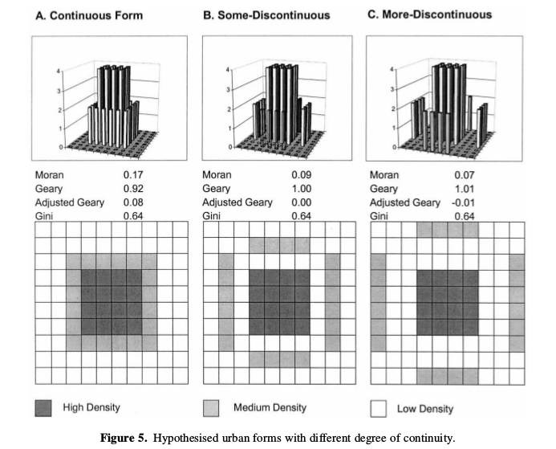

```{r setup, include=FALSE}
knitr::opts_chunk$set(echo = TRUE,fig.width =6,fig.align="center", fig.height = 3)
library(knitr)
library(sf)
library(ggplot2)
library(cartography)
library(xtable)
```

# Analyse spatiale 


## Contenu du cours

L'analyse spatiale s'intéresse aux **structures** récurrentes de l'espace et à leur influence sur les processus que cet espace supporte. 

Exemple de concepts courants: distance, flux , polarisation, effet de frontière, ...

1. Analyse de semis de points

2. Autocorrelation spatiale 

3. Notions sur les flux 

4. Modèle gravitaire 

<span style="color:red; font-size:1.5em;">&#9888;</span> Une **bonne** carte surpasse toute analyse statistique spatiale statique</span>

## Semis de points

Données **ponctuelles** i.e. individus localisés à un point.

On peut étudier la répartition de ces points dans l'espace qu'on suppose **isotrope**.


## Statistiques simples

**Point moyen** (pondéré ou non) , **point median**.


Le point médian est le point le plus accessible du semis. Il sépare la population en quatre cadrants contenant chacun 25% de l'effectif  

La **dispersion** du nuage de points est approchée par la **distance type** (euclidienne)) :

$\sigma_{Dist}= \sqrt{\frac{1}{n}\sum_{i=1}^n(X_i-\bar {X})^2 + (X-\bar{X})^2} =  \sqrt{\sigma_X^2 +\sigma_Y^2}$


## Concentrations du semis

Pour estimer si la répartition d'un semis de $n$ points est régulière : 

- on discrétise l'espace en $C$ mailles de formes régulière( carrée, hexagonale) 
- on calcule le nombre de points théorique par maille (la densité) : $D= n/C$
- on compte le nombre de points par maille et on calcule la variance $var(D)$ ou le de ce nombre

Indice de concentration : $IC= var(D)/D$

- si IC = 1 , la distribution est aléatoire 
- si IC > 1 , la distribution est concentrée
- si IC < 1 , la distribution est homogène  

## Le modele nul pour un semis de points 


Un processus de spatial de Poisson est un processus spatialement
aléatoire.

Dans un espace découpé en zones, on estime la probabilité d'avoir un nombre de points)dans une zone $z$ par une distribution de poisson de moyenne $\lambda * surface(zone)$.


## Afficher la distribution, le retour

```{r polar1, cache =T, fig.height=4, fig.width=8, echo=F }
ssd <-  read_sf("neufTrois_simple.shp")
par(mar=c(0,0,0,0))
par(mfrow=c(1,2))
pts <-  st_sample(ssd, rep(2, length(ssd$geometry)))
plot(ssd$geometry, lwd=0.8, border="gray")
plot(pts, add=T, pch=20, cex= 0.4, col= "orange" )
pts2 <-  st_sample(ssd, 614*2)
plot(ssd$geometry, lwd=0.8, border="gray", reset=T)
plot(pts2, add=T, pch=20, cex= 0.4, col= "orange" )
coordsPT1 <-  as.data.frame(st_coordinates(pts))
coordsPT2 <-  as.data.frame(st_coordinates(pts2))
#cat("gauche", sqrt(sd(coordsPT1$X)**2 + sd(coordsPT1$Y)**2))
#cat("droite", sqrt(sd(coordsPT2$X)**2 + sd(coordsPT2$Y)**2))

```

Le nombre de points est identique dans les deux cartes. 

A gauche: distance type = 6423.3   A droite: distance type =7196.3


# Autorcorrélation spatiale : Moran et Geary

## L'autocorrélation spatiale 

L'autocorrélation spatiale est une mesure statistique qui répond à la question suivante: 

<center>
« Les valeurs d'entités spatiales proches sont-elles plus similaires que les valeurs d'entités lointaines ?»

«Est-ce que les grosses(resp. petites) valeurs sont rapprochées (resp.dispersées) ? »</center>

\
E.g. (au hasard) Les personnes pauvres et les personnes riches sont-elles regroupées au même endroit dans une ville ?

Valeurs positives : situations ségrégées

Valeurs nulles : répartition aléatoire

Valeurs négatives : alternance parfaite entre valeurs 


## L'indice de Moran 

L'indice $I$ de Moran utilise un terme $\omega_{ij}$  positif d'"interaction" pour quantifier la **proximité** entre deux entités $i$ et $j$.

On peut le choisir discret (1 si voisins , 0 sinon) ou continu (inverse de la distance).

$I=\frac{n}{\sum_i \sum_j \omega_{ij}} \frac{\sum_i \sum_j \omega_{ij}(X_i-\bar{X})(X_j-\bar{X})}{\sum_i(X_i-\bar{X})^2}$

<span style= "font-size:0.5;"> avec $n$ le nombre d'entités spatiales , 

$\omega$ une matrice carrée de poids positifs de dimension $n$, telle que $\omega_{ij}$ quantifie la proximité, l'influence de $j$ sur $i$ , 

$\bar{X}$ la moyenne de la variable $X$ </span> 

## L'indice de Geary 

Cet indice, noté $C$,  est dit plus "local" que l'indice de Moran 


$C=\frac{(n-1) \sum_i \sum_j \omega_{ij}(X_i-X_j)^2 }{2W\sum_i(X_i-\bar{X})^2}$

$C\in[0;2]$  

$C<1$ : auto-corrélation négative, 

$C=1$ : pas d'autocorrelation, 

$C>1$ :  autocorrélation positive

<span style= "font-size:0.6em;"> avec <br>$n$ le nombre d'entités spatiales,<br> 
$\omega$ une matrice carrée de poids positifs de dimension $n$, de somme $W$ et telle que $\omega_{ij}$ quantifie la proximité, l'influence mutuelle de $j$ sur $i$, $\bar{X}$ la moyenne de la variable $X$ </span> 


## Commandes R

fonction `moran` et `geary` du package `spdep`


## Exemples 




## Exemples 


# Les flux

## Matrice de flux

Pour une partition en zones d'un espace, on appelle flux toute mesure d'intéraction spatiale qui implique des échanges, des déplacements entre deux zones, matériels ou immatériels.   

On parle alors de **matrice de flux**,une matrice carrée $F$ dont le terme général $F_{ij}$  indique la quantité échangée de $i$ en ligne vers $j$ en colonne .

## Indices 

$V_i= \sum_i F_{ij} + \sum_j F_{ij}$  : Volume = Départs + Arrivées

$S_i = \sum_i F_{ij} - \sum_j F_{ij}$  : Solde= Départs - Arrivées

$A_i = \frac{S_i}{V_i}$  : Attractivité = ratio des soldes sur les volumes


## Cartographie des flux 


On en peut pas représenter tous les flux entre toutes les zones (lisibilité).

On détermine les flux **dominants** de la façon suivante:

$F_{ij}$ est dominant si:

 - $i$ envoie son flux le plus important vers $j$
 - la somme des arrivées  de $j$ est plus importante que la somme des arrivées de $i$ 


package `flows` de R : https://cran.r-project.org/web/packages/flows/vignettes/flows.html par les auteurs de `cartography`

## Exemple
```{r flow, echo=F, fig.height=5.5, fig.width=6}
# Import data
library(flows)
data(nav)
myflows <- prepflows(mat = nav, i = "i", j = "j", fij = "fij")

# Remove the matrix diagonal
diag(myflows) <- 0

# Select flows that represent at least 20% of the sum of outgoing flows for 
# each urban area.
flowSel1 <- firstflows(mat = myflows/rowSums(myflows)*100, method = "xfirst", 
                       k = 20)


# Select the dominant flows (incoming flows criterion)
flowSel2 <- domflows(mat = myflows, w = colSums(myflows), k = 1)

# Combine selections
flowSel <- myflows * flowSel1 * flowSel2

# Node weights
inflows <- data.frame(id = colnames(myflows), w = colSums(myflows))

# Plot dominant flows map
opar <- par(mar = c(0,0,2,0))
sp::plot(GE, col = "#cceae7", border = "gray")
plotMapDomFlows(mat = flowSel, spdf = UA, spdfid = "ID", w = inflows, wid = "id",
                wvar = "w", wcex = 0.05, add = TRUE,
                legend.flows.pos = "topright",
                legend.flows.title = "Nb. of commuters")
title("Dominant Flows of Commuters in the French Grand Est")
mtext(text = "INSEE, 2011", side = 4, line = -1, adj = 0.01, cex = 0.8)
```

## Pour aller plus loin


les flux sont modélisés par des graphes, une grande partie de la littérature de l'analyse de réseaux et des notions de théories des graphes peuvent être transposées et utilisées pour l'analyse de flux.

E.g. Attributs de noeuds ou d'arcs : 

- centralité de degré (nombres de voisins dans le graphe)
- centralité d'intermédiarité (fréquence d'apparition du noeud dans les plus courts chemins entre deux noeuds du graphe)

Attributs de graphes : 

- communautés (sous graphes denséments connectés)
- densité de liens
- ...


# Le modèle gravitaire 

## Fin XIX<sup>e</sup> : Les lois de Ravenstein
(Ravenstein E., 1885 & 1889, "The Laws of Migration", Journal of Royal Statist. Society, London , d'après Noin D., 1988, Géographie de la Population, Masson, Paris, pp. 273-274, cité par C. Grasland.

<span style= "font-size:0.6em; line-height:normal;">Le nombre de migrants diminue quand la distance augmente; la plupart ne vont pas très loin ; ceux qui se déplacent sur de grandes distances se dirigent de préférence vers les grands centres commerciaux et industriels.<br>
    Le processus se fait de la façon suivante : une ville à croissance rapide attire les gens des régions environnantes ; les vides ainsi créés sont comblés par les migrants de districts plus éloignés ; la force d'attraction des grandes villes dynamiques se fait donc sentir de proche en proche en diminuant d'intensité. Le nombre de migrants de la zone d'accueil est donc **proportionnel à la population de la zone d'origine et inversement proportionnel à la distance qui les sépare**.<br>
    Chaque courant principal de migration suscite un contre-courant compensatoire.<br>
    Les citadins ont une mobilité plus faible que les ruraux<br>
    Les femmes ont une mobilité plus forte que les hommes, au moins à courte distance.<br>
    L'intensité des migrations augmente avec le développement du commerce, de l'industrie et des transports<br>
    Les facteurs déterminant la migration sont nombreux mais le plus important est le facteur économique</span>


## Le modèle gravitaire

Modèle simple, déterministe et symmétrique qui prose de calculer l'intensité de l'interaction entre deux entités spatiales en fonction de leurs **masses** et de la distance qui les sépare.

Plusieurs formulations : 

$Fij = k \frac{P_i . P_j}{D_{ij}^2}$

avec $P_i$ la masse (e.g. population, attraction, emmission, etc.) de l'entité spatiale $i$, $D_ij$ une fonction de **coût** e.g. la distance qui sépare $i$ de $j$

$Fij = k \frac{P_i . P_j}{D_{ij}^\alpha}$

avec alpha le **frein à la distance** (distance decay) , pour modéliser des déplacements plus ou moins faciles 


## Distance et interaction 

<p style= "font-size:0.6em; line-height:normal;"> D'après H.Commenges, cours d'analyse spatiale , Delhi R School</p>

Lorsque l’interaction est spatialisée, elle implique nécessairement une **distance**.

- L’interaction spatiale considère le déplacement comme un effort.
- L’interaction spatiale est le rapport dialogique entre **mise en contact** et **friction de l’éloignement**.
- L’interaction spatiale être abordée de deux façons : relations entre lieux ou attraction/influence d’un lieu sur les autres lieux.
- Dans le premier cas on parlera d’analyse de flux
 - Dans le second cas on parlera d’analyse de position (cf. Accessibilité)


## Utilisation du modèle gravitaire

Exemple d'une formulation plus générale : 
$F_{ij} = \alpha_i \beta_j E_i A_j C_{ij}^{−n}$ 

<p align="left" style="font-size: 70%">
avec $\alpha_i$ et$\beta_j$ des facteurs d'équilibrage qui assurent la contrainte aux marges,<br>
$E_i$ et $A_j$ :  valeurs d’émission et d’attraction de la zone <br>
$C_{ij}$ : coût généralisé du trajet de $i$ vers $j$ : temps, prix , inconfort.<br>
$n$ : frein à la distance, la valeur varie selon les motifs de déplacement. (plus faible vers le travail que vers des motifs "secondaires" (e.g. courses quotidiennes)<br><br>


On détermine les valeurs des coefficients ($\alpha,\ \beta,\ n$)inconnus  par **calibration** sur des données (problème d'optimisation classique, qu'on peut résoudre par algorithme génétique, recuit simulé, etc.)


## Variantes du modèles gravitaires 

Nature des masses: population, emplois, émission , attraction , offre, demande
Pondérations des masses : facteurs ou exposants
Fonction de friction : puissance , exponentielle
Contraintes aux marges : aucune , simple, double


  